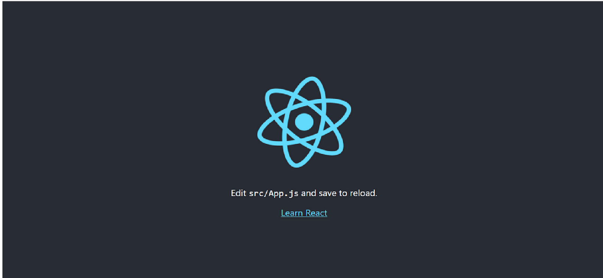

A.  Pengertian React
 
React adalah sebuah library JavaScript yang digunakan untuk membangun user interface yang interaktif. Library ini dibuat oleh Facebook dan bersifat open source. Library ini sangat populer digunakan dan  selalu dikembangkan baik oleh kontributor utama ataupun komunitas. React terkenal karena konsep komponen. Di dalam React ada dua tipe komponen, yaitu:

1. Functional component

Functional component adalah komponen React yang dibangun murni menggunakan fungsi JavaScript. Functional component tidak menyimpan state dan digunakan hanya untuk menampilkan UI. Dengan kata lain, komponen ini dapat disebut dengan komponen stateless. Walaupun stateless, komponen ini dapat menerima data melalui properti atau dikenal dengan props.

2. Class component

Class component ialah komponen yang dibuat melalui Class JavaScript dan mewarisi sifat React Component. Berbeda dengan Functional Component, Class Component dapat menyimpan dan mengelola state  serta memiliki beberapa metode salah satunya adalah render digunakan untuk menampilkan UI. Komponen ini dapat disebut dengan komponen stateful karena dapat memiliki state. Berikut beberapa kelebihan ketika kita memanfaatkan komponen React dalam membuat UI website:

- State Management: 

Ketika membuat stateful komponen, kita bisa memanfaatkan state untuk memutuskan bagaimana UI di-render berdasarkan sebuah nilai/keadaan secara reactive.

- Encapsulated: 

Seluruh data (gambar, CSS, atau data terstruktur) yang dibutuhkan oleh komponen dalam menampilkan UI berada di dalam komponen tersebut. Itulah mengapa komponen React terenkapsulasi.

- Reusable: 

Selain terenkapsulasi, komponen React juga bersifat reusable atau dapat digunakan kembali. Kita tidak perlu membuat banyak komponen untuk menampilkan UI yang sama. Cukup gunakan yang sudah kita buat.

- Fast Development: 

Efek dari komponen yang reusable adalah pengembangannya jadi cepat. Berbeda bila kita harus membuat segala sesuatu dari nol.
kemudian  Berikut adalah fitur-fitur yang ada di React:

- JSX

JSX merupakan ekstension dari sintaks JavaScript yang memungkinkan kita untuk menuliskan sintaks bergaya XML guna memodifikasi DOM (Document Object Model). 
Sedikit penjelasan mengenai DOM, DOM sendiri adalah Application Programming Interface yang memiliki fungsi untuk mengatur struktur halaman dari website. Jadi, untuk kita yang ingin menambahkan konten yang dinamis ke dalam halaman web, kita harus memodifikasi DOM ini.

JSX dapat dikatakan sebagai ekstension yang dapat digunakan untuk mempermudah kita dalam menambahkan konten dinamis ke dalam halaman website. Karena ekstension ini dapat membantu kita dalam memasukan kode bergaya XML ke dalam DOM.

- Data binding searah

Data binding ini merupakan suatu proses menghubungkan elemen tampilan atau user interface dengan data atau komponen yang mengisinya. Data binding pada React ini merupakan data binding satu arah. Salah satu kondisinya mungkin dapat terlihat seperti ini:

    - Component to View : Setiap perubahan yang terjadi dalam data component akan terlihat dalam view.

    - View to Component : Setiap perubahan yang terjadi dalam view akan terlihat juga dalam component.

# Jadi, Apa itu React?
 React adalah sebuah library JavaScript yang sering digunakan untuk membangun user interface yang interaktif. React ini dibuat oleh Facebook dan bersifat open source. Ada beberapa fitur yang sangat berguna untuk kamu para pengembang website, seperti JSX yang berguna untuk memodifikasi DOM, dan memiliki data binding yang bersifat searah.

# Introduction React JS

- Windows Version

1. Download Node JS version >= 12 (Terbaru)
    
    https://nodejs.org/en/download

2. Install Node JS

3. Check Node
    
        node --version

4. Check NPM
    
        npm --version

5. Install Create React App Library

    npm install -g create-react-app

- Linux Version

1. Install Node JS
    
    $ sudo apt-get install nodejs

2. Check Node JS

    $ node -v

3. Install Create React App Library

    $ npm install -g create-react-app

# Inisialisasi Proyek

1. Buka Terminal atau Command Prompt (CMD)
Lakukan perintah pada terminal yang telah dibuka :

2. Lakukan perintah pada terminal yang telah dibuka :

    npx create-react-app [name-project]

Contoh :

    npx create-react-app example-project-1

3. Install library react-router

    npm install react-router@5.3.3

# Menjalankan Proyek

1. Buka folder proyek yang telah dibuat, kemudian jalankan Terminal / CMD pada folder tersebut.

3. Lakukan perintah
    
    npm run start

3. Jika sudah dijalankan tampilan yang muncul seperti gambar dibawah :

#

#
B. Bootstrap

adalah sebuah framework HTML, CSS, dan JavaScript yang berfokus untuk menyederhanakan pengembangan halaman web atau website. Pada umumnya, Bootstrap digunakan untuk mengimplementasikan berbagai pilihan warna, ukuran, font, dan layout yang ada dalam framework tersebut ke dalam sebuah website. Pada awal pengembangannya, Bootstrap memiliki nama lain, yaitu Twitter Blueprint. Mark Otto dan Jacob Thornton mengembangkan Bootstrap untuk meningkatkan konsistensi dalam berbagai alat internal yang digunakan dalam pengembangan website.

Sebagai sebuah framework, Bootstrap menyediakan template untuk mendefiniskan style dasar seluruh elemen HTML dalam sebuah website. Hal ini akan mempermudah dalam pembuatan website dengan keseragaman visual tanpa harus mendefinisikan style attribute untuk setiap elemen HTML secara berulang-ulang.

Selain elemen HTML dan CSS, Bootstrap juga manawarkan beberapa komponen JavaScript dalam bentuk plugin jQuery. Adanya plugin jQuery ini memungkinkan pengguna Bootstrap untuk menggunakan beberapa fitur interaktif seperti dialog box, tooltips, carousel, dan sebagainya.

Setiap komponen Bootstrap terdiri dari tiga bagian utama:

- HTML structure

- CSS declarations

- JavaScript code

# Cara Menggunakan Bootstrap

Berikut ini adalah cara menggunakan Bootstrap dalam project kamu:

1. Langkah pertama adalah menyalin link menuju CSS dari Bootstrap:

    
        <link href="https://cdn.jsdelivr.net/npm/bootstrap@5.1.3/dist/css/bootstrap.min.css" rel="stylesheet" integrity="sha384-1BmE4kWBq78iYhFldvKuhfTAU6auU8tT94WrHftjDbrCEXSU1oBoqyl2QvZ6jIW3" crossorigin="anonymous">

2. Installasi dan Konfigurasi React Bootstrap

Sekarang kita lanjutkan belajar bagaimana cara installasi da konfigurasi React Bootstrap di dalam project React.js. Silahkan jalankan perintah berikut ini di dalam terminal/CMD dan pastikan berada di dalam project React.js.

    npm install react-bootstrap@2.0.0-beta.5 bootstrap@5.1.0

ika perintah di atas berhasil dijalankan, maka seharusnya kita akan mendapatkan 2 list baru di dalam file package.json. tepatnya di dalam dependencies.

    "dependencies": {
	
    ...
    "bootstrap": "^5.1.0",
    "react-bootstrap": "^2.0.0-beta.5",
    ...
    },

ika sudah seperti di atas, artinya React Bootstrap sudah terinstall di dalam project React.js kita. Sekarang kita tinggal melakukan konfigurasi agar Bootstrap dapat digunakan di dalam project React.js

Silahkan buka file src/index.js dan ubah kode-nya menjadi seperti berikut ini :

    import React from 'react';
    import ReactDOM from 'react-dom';
    //import Bootstrap CSS
    import 'bootstrap/dist/css/bootstrap.min.css';
    import './index.css';
    import App from './App';

    ReactDOM.render(
    <React.StrictMode>
    <App />
    </React.StrictMode>,
    document.getElementById('root')
    );

Di atas, kita melakukan import CSS dari Boostrap, kurang lebih seperti berikut ini :

    //import Bootstrap CSS
    import 'bootstrap/dist/css/bootstrap.min.css';

Dengan begini, kita sudah bisa menggunakan Boostrap di dalam project React.js.